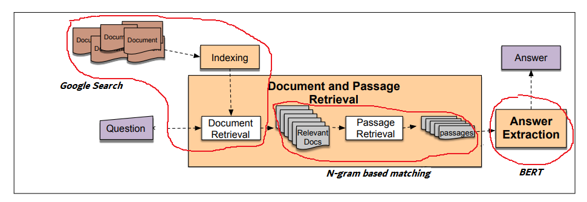

# Hệ thống trả lời câu hỏi tiếng Việt với BERT

- Câu hỏi: Người giàu nhất Việt Nam?
- Trả lời: Phạm Nhật Vượng

- Câu hỏi: Ai là tác giả của ngôn ngữ lập trình C?
- Trả lời: Dennis Ritchie

### Cài đặt các gói cần thiết (python3)
```bash
pip3 install -r requirements.txt
```

### Tải mô hình huấn luyện trước
- Đường dẫn: https://drive.google.com/open?id=1ml-Qwv4yHxepp852N-aL0U5iZzqLNZ4B
- Sau khi tải về, giải nén và đặt tất cả các tệp vào thư mục "resources"

### Hạn chế
Do giới hạn của tập dữ liệu hiện tại, hệ thống chỉ hỗ trợ các câu hỏi về người

# Cải tiến trong tương lai
 - Bổ sung thêm dữ liệu huấn luyện và mở rộng các loại câu hỏi
 - Tận dụng tập dữ liệu tiếng Anh (https://rajpurkar.github.io/SQuAD-explorer/):
     - Có thể dịch dữ liệu tiếng Anh sang tiếng Việt (sử dụng Google Translation API) và kết hợp dữ liệu đã dịch vào tập dữ liệu gốc
     - Có thể huấn luyện trước mô hình trên dữ liệu đã dịch và sau đó huấn luyện lại trên tập dữ liệu tiếng Việt
     - Áp dụng các phương pháp học chuyển giao đa ngôn ngữ (Cross-lingual Transfer Learning)
 - Sử dụng học máy cho bước truy xuất thông tin. Tập dữ liệu có thể tìm thấy tại https://challenge.zalo.ai/portal/question-answering

# Tổng quan về kiến trúc
 - Trả lời câu hỏi dựa trên truy xuất thông tin - Xử lý ngôn ngữ và tiếng nói (Daniel Jurafsky)
 - https://web.stanford.edu/~jurafsky/slp3/24.pdf
 - Để hiểu rõ hơn: Mở tệp notebook --> thay đổi câu hỏi --> chạy từng dòng
 


## Kiến trúc mã nguồn


### Ví dụ:

câu hỏi = 'ai là người giàu nhất Việt Nam'

### Sử dụng Google để tìm các tài liệu liên quan:
----------------------------------------------
Tài liệu 0

Passage: Tính đến ngày 28/12, theo Forbes, Việt Nam có 6 tỷ phú USD với tổng tài sản đạt 13,4 tỷ USD, tăng nhẹ so với mức 13,2 tỷ USD hồi đầu năm. Ông Phạm Nhật Vượng ghi nhận tài sản giảm nhẹ nhưng vẫn là người giàu nhất trong danh sách. Trên thị trường chứng khoán Việt Nam, ông Vượng giàu nhất năm thứ 15 liên tiếp, giữ vị trí số 1 từ năm 2010 tới nay. Chủ tịch Tập đoàn Vingroup (VIC) kiêm CEO VinFast (VFS) Phạm Nhật Vượng có tài sản trị giá 4,1 tỷ USD, xếp thứ 833 trên thế giới; giảm so với mức 4,6 tỷ USD hồi đầu năm. Chủ tịch VietJet (VJC) Nguyễn Thị Phương Thảo xếp thứ hai trong số các tỷ phú Việt Nam với tài sản đạt 2,8 tỷ USD, tăng so với mức 2,4 tỷ USD hồi đầu năm. Chủ tịch Tập đoàn Hòa Phát (HPG) Trần Đình Long đứng thứ ba với 2,4 tỷ USD, so với mức 2,3 tỷ USD hồi đầu năm. Chủ tịch Techcombank (TCB) Hồ Hùng Anh xếp vị trí thứ tư với 1,8 tỷ USD, so với mức 1,4 tỷ USD đầu năm 2024. Ông Trần Bá Dương (Thaco) và gia đình xếp thứ 5 với 1,2 tỷ USD, giảm so với mức 1,5 tỷ USD đầu năm. Chủ tịch Masan Group (MSN) Nguyễn Đăng Quang có tài sản không đổi ở mức 1 tỷ USD. Tính theo giá trị cổ phiếu các đại gia nắm giữ trên sàn chứng khoán, các vị trí cũng không có nhiều thay đổi. Giàu nhất vẫn là ông Phạm Nhật Vượng với hơn 84 nghìn tỷ đồng (khoảng 3,3 tỷ USD). Ông Trần Đình Long đứng thứ 2 với hơn 44,3 nghìn tỷ đồng. Bà Nguyễn Thị Phương Thảo ở vị trí thứ 3 với hơn 23,7 nghìn tỷ đồng. Các tỷ phú giàu nhất Việt Nam. Ảnh: DK Ông Đỗ Anh Tuấn (Chủ tịch Sunshine) xếp vị trí thứ 4 tính theo giá trị cổ phiếu nắm giữ, với tổng giá trị hơn 23,5 nghìn tỷ đồng, xếp trên ông Hồ Hùng Anh (20,6 nghìn tỷ đồng), ông Nguyễn Đăng Quang (19,5 nghìn tỷ đồng). Trong năm 2024, giới đầu tư ghi nhận Chủ tịch Tập đoàn FPT Trương Gia Bình nằm trong top 10 người giàu nhất, với tài sản hơn 13,3 nghìn tỷ đồng. Năm 2023, có thời điểm ông Bình trở lại danh sách này sau 14 năm. Năm 2006, ông Trương Gia Bình là người giàu nhất trên sàn chứng khoán Việt Nam (khi đó ông Bình có 2.350 tỷ đồng). Năm 2007, vị trí này thuộc về ông Đặng Thành Tâm (6.290 tỷ đồng). Năm 2008 và 2009 là ông Đoàn Nguyên Đức (6.160 tỷ và 11.440 tỷ đồng). Các năm sau đó vị trí số 1 thuộc về ông Phạm Nhật Vượng. Năm 2024, ông Đặng Thành Tâm xếp thứ 34 với hơn 4.000 tỷ đồng. Ông Đoàn Nguyên Đức (Bầu Đức) đứng thứ 42 với hơn 3.800 tỷ đồng. Bà Vũ Thị Hiền (vợ ông Trần Đình Long) vẫn ở vị trí thứ 8 giống như năm trước. Tuy nhiên, năm 2024 chứng kiến Chủ tịch Novaland (NVL) Bùi Thành Nhơn, Chủ tịch Bất động sản Phát Đạt (PDR) Nguyễn Văn Đạt và bà Phạm Thu Hương (vợ ông Phạm Nhật Vượng) rời khỏi top 10 người giàu nhất. Thay vào đó là ông Trương Gia Bình, bà Nguyễn Thị Thanh Thủy (vợ ông Hùng Anh) với 9.044 tỷ đồng, bà Nguyễn Thị Thanh Tâm (mẹ ông Hùng Anh) với 8.567 tỷ đồng. Biến động tài sản tỷ phú USD Việt trong năm 2024 theo tính toán của Forbes. Biểu đồ: M. Hà Năm tới, tài sản các tỷ phú biến động ra sao? Giống như năm 2023, nhiều doanh nghiệp bất động sản vẫn gặp khó khăn do nợ nần, dù có những khoảng thời gian thị trường địa ốc sôi động. Đây là nguyên nhân khiến tài sản nhiều đại gia suy giảm; trong đó có ông Nhơn, ông Đạt khi bị rơi khỏi top 10. Ngành bán lẻ, sản xuất kinh doanh ô tô... cũng gặp khó nên tài sản của các doanh nhân như Trần Bá Dương, Nguyễn Đăng Quang, Nguyễn Đức Tài suy giảm hoặc không tăng. Ngành vật liệu xây dựng tích cực hơn, giá thép hồi phục giúp HPG đi lên và tài sản tỷ phú Trần Đình Long tăng nhẹ. HPG cũng đang đẩy nhanh tiến độ Nhà máy Dung Quất 2 tại Quảng Ngãi, dự kiến hoàn thành đầu năm 2025. Với Vingroup, năm 2024 chứng kiến sự tái cấu trúc quyết liệt của tỷ phú Phạm Nhật Vượng với hàng loạt thương vụ lớn như bán Vinhomes Vũ Yên, bán VinBrain cho Nvidia, bán Vincom Retail (VRE)... ; những tín hiệu tích cực từ hãng xe VinFast (VFS) và sự tham gia của thế hệ thứ 2 các con trai của ông Vượng. Tuy nhiên, thách thức cũng còn nhiều. Ông Bùi Thành Nhơn năm thứ 3 liên tiếp không còn nằm trong danh sách tỷ phú USD của Forbes. Ngân hàng là nhóm có kết quả kinh doanh vẫn khá tốt và tăng trưởng tín dụng cuối năm gần đạt so với mục tiêu NHNN đề ra. Tài sản của ông Hùng Anh và gia đình tăng khá mạnh trong năm 2024. Nhiều cổ phiếu ngân hàng khác như Vietinbank (CTG), Sacombank (STB) của ông Dương Công Minh lên đỉnh lịch sử... Hai người con của ông Hồ Hùng Anh (Chủ tịch Techcombank) là Hồ Thủy Anh và Hồ Anh Minh lọt top 11-12 người giàu nhất trên TTCK. Du lịch hồi phục góp phần thúc đẩy ngành hàng không. Tài sản tỷ phú Nguyễn Thị Phương Thảo tăng mạnh nhất, thêm 500 triệu USD. Trong năm 2025, khả năng du lịch và hàng không sẽ tiếp tục khởi sắc. Dòng vốn FDI đổ mạnh vào Việt Nam không chỉ góp phần giúp nhóm bất động sản công nghiệp (như ông Đặng Thành Tâm, ông Trần Đình Long, ông Phạm Nhật Vượng... ), mà còn thúc đẩy du lịch. Năm 2024, ông Đào Hữu Huyền (Hóa chất Đức Giang) và ông Hồ Xuân Năng (Vicostone) cũng ghi nhận sự bứt phá, tài sản tăng thêm hơn 1.000 tỷ mỗi người, lên lần lượt 8.330 tỷ đồng và 8.060 tỷ đồng. Theo Nghị quyết Chính phủ ban hành hồi tháng 5, đến năm 2030, Việt Nam phấn đấu có ít nhất 10 tỷ phú USD. Ông Vượng, ông Long, bà Thảo, ông Hùng Anh được xem là tỷ phú đứng vững trong danh sách của Forbes. Giới đầu tư kỳ vọng, danh sách này sẽ sớm có tên ông Trương Gia Bình khi FPT đang dồn lực vào mảng trí tuệ nhân tạo (AI). Ngoài ra là ông Đỗ Anh Tuấn - Chủ tịch CTCP Tập đoàn Sunshine (KSF) và CTCP Phát triển Sunshine Homes (SSH), ông Đào Hữu Huyền - Hóa chất Đức Giang hay ông Nguyễn Văn Đạt - Bất động sản Phát Đạt... Việt Nam cũng có nhiều doanh nhân nổi tiếng, được xem là siêu giàu nhưng kín tiếng như bà Nguyễn Thị Nga BRG, ông Vũ Văn Tiền Geleximco, ông "vua hàng hiệu" Johnathan Hạnh Nguyễn, ông Đỗ Minh Phú Doji, ông Đỗ Quang Hiển T&T, gia đình ông Đặng Văn Thành - Thành Thành Công... Việt Nam sẽ có 10 tỷ phú USD: Doanh nhân nào giàu tiềm năng nhất?Theo nghị quyết vừa ban hành của Chính phủ, đến năm 2030, Việt Nam phấn đấu có ít nhất 10 tỷ phú USD, 5 doanh nhân quyền lực nhất châu Á. Vậy ai sẽ là 4 cái tên tiếp theo sau 6 tỷ phú USD hiện tại?

Answer : Phạm Nhật Vượng

Score : 0.9998912321667877
